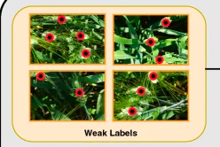

	

		

			
		

		

			<b> EasyRFP: An Easy to Use Edge Computing Toolkit for Real-Time Field Phenotyping</b>  
			<i><b>Sai Vikas Desai</b>, Akshay L Chandra, Masayuki Hirafuji, Seishi Ninomiya, Vineeth N Balasubramanian, Wei Guo</i>  
			ECCV 2020 Workshops - CV Problems in Plant Phenotyping
			 
			<a href="https://www.plant-phenotyping.org/lw_resource/datapool/systemfiles/elements/files/d69a63a7-eb90-11ea-908c-dead53a91d31/current/document/camera_ready_9.pdf" style="text-decoration: none;" class="btn btn-success btn-lg active align-bottom" role="button" aria-pressed="true">Paper</a>
		

	

	

		

			
		

		

			<b> Towards Fine Grained Sampling for Active Learning in Object Detection</b>  
			<i><b>Sai Vikas Desai</b>, Vineeth N Balasubramanian</i>  
			CVPR 2020 Workshops - Visual Learning with Limited Labels
			 
			<a href="https://openaccess.thecvf.com/content_CVPRW_2020/html/w54/Desai_Towards_Fine-Grained_Sampling_for_Active_Learning_in_Object_Detection_CVPRW_2020_paper.html" style="text-decoration: none;" class="btn btn-success btn-lg active" role="button" aria-pressed="true">Paper</a>
		

	

	

		

			
		

		

			<b> Computer Vision with Deep Learning for Plant Phenotyping in Agriculture: A Survey</b>  
			<i>Akshay L Chandra, <b>Sai Vikas Desai</b>, Vineeth N Balasubramanian, Wei Guo</i>  
			ACCS Journal, March 2020
			 
			<a href="https://journal.accsindia.org/computer-vision-with-deep-learning-for-plant-phenotyping-in-agriculture-a-survey/" style="text-decoration: none;" class="btn btn-success btn-lg active" role="button" aria-pressed="true">Paper</a>
		

	

	

		

			
		

		

			<b> Active Learning with Point Supervision for Cost-Effective Panicle Detection in Cereal Crops </b>  
			<i>Akshay L Chandra, <b>Sai Vikas Desai</b>, Vineeth N Balasubramanian, Seishi Ninomiya, Wei Guo</i>  
			BMC Plant Methods Journal, March 2020 <b>(Impact Factor: 4.4)</b>
			 
			<a href="https://plantmethods.biomedcentral.com/articles/10.1186/s13007-020-00575-8" style="text-decoration: none;" class="btn btn-success btn-lg active" role="button" aria-pressed="true">Paper</a>
		

	

	

		

			
		

		

			<b> An Adaptive Supervision Framework for Active Learning in Object Detection </b>  
			<i><b>Sai Vikas Desai</b>, Akshay L Chandra, Vineeth N Balasubramanian, Wei Guo</i>  
			BMVC 2019
			 
			<a href="https://bmvc2019.org/wp-content/uploads/papers/0921-paper.pdf" style="text-decoration: none;" class="btn btn-success btn-lg active" role="button" aria-pressed="true">Paper</a>
		

	

	

		

			
		

		

			<b> Automatic estimation of heading date of paddy rice using deep learning </b>  
			<i><b>Sai Vikas Desai</b>, Vineeth N Balasubramanian, Tokihiro Fukatsu, Seishi Ninomiya, Wei Guo</i>  
			BMC Plant Methods Journal, July 2019 <b>(Impact Factor: 4.4)</b>
			 
			<a href="https://plantmethods.biomedcentral.com/articles/10.1186/s13007-019-0457-1" style="text-decoration: none;" class="btn btn-success btn-lg active" role="button" aria-pressed="true">Paper</a>
		

	

	

		

			
		

		

			<b>AI Based High Throughput Crop Phenotyping using Drone and Static Images</b>  
			<i><b>Sai Vikas Desai</b>, Ajay Kumar, Mahesh Taparia, P Rajalakshmi, Vineeth Balasubramanian, Wei Guo</i>  
			Workshop on AI and its Impact on Society in Developing Nations (AAAI event), Dec 2018
			 
			<a href="https://drive.google.com/file/d/1IBLUeyHKzuxwAkGRlIGyXgfddIEGyt-s/view?usp=sharing" style="text-decoration: none;" class="btn btn-success btn-lg active" role="button" aria-pressed="true">Paper</a>
		

	

